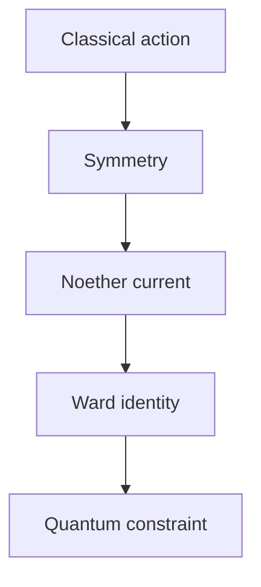

# physicslly Blog Instructions

## Project Context

This repository is the Jekyll Chirpy source for the `physicslly` physics blog.

Production URL:

https://physicslly.github.io/

This is a GitHub Pages user site. Keep these settings in `_config.yml` unless the user explicitly asks for a deployment change:

```yaml
url: "https://physicslly.github.io"
baseurl: ""
```

Do not use a custom domain. Do not create or modify `CNAME`.

The blog identity is:

- Name: `physicslly`
- Theme: theoretical physics and the search for a Theory of Everything
- Scope: quantum field theory, general relativity, quantum gravity, gauge theory, topology, geometry, cosmology, renormalization, effective field theory, and mathematical physics

"Theory of Everything" is a research direction, not a solved claim. Never write as if the blog has solved unification.

## Repository Rendering Profile

This repository uses:

- Jekyll with the `jekyll-theme-chirpy` theme.
- GitHub Pages user-site deployment.
- Kramdown/GFM-style Markdown processing.
- Chirpy post layout with `math: true` front matter.
- Client-side MathJax-style rendering for equations.
- Generated output in `_site/`.

The source of truth for rendering behavior is:

- `_config.yml`
- `Gemfile`
- `CLAUDE.md`
- `scripts/strict_math_audit.py`
- existing source Markdown posts in `_posts/`

Before writing or editing math-heavy articles, inspect `_config.yml`, `Gemfile`, and this file enough to understand the theme, plugins, Markdown renderer, permalink style, and math rules.

Never assume that LaTeX valid in isolation will render safely in this Chirpy template. Math must be written in Markdown-safe form.

## Chirpy-Safe Math Writing Rules

Use math syntax that is safe for Jekyll Chirpy, Kramdown, Markdown, and browser-side MathJax.

Hard rules:

- Use `$...$` only for very short inline expressions.
- Use display math for transformations, derivations, long definitions, field expansions, correlators, and equations with more than one LaTeX command.
- Never write equation-heavy prose with many inline math segments.
- Never put `$$...$$` inside a prose line.
- `$$` must appear alone on its own line.
- Always put a blank line before and after display math.
- Never indent equations with four spaces.
- Never indent normal paragraphs with four spaces.
- Never put equations inside triple backticks.
- Never put equations inside Markdown tables.
- Never use `\(...\)` or `\[...\]`.
- Avoid raw vertical-bar ket notation such as `$|0\rangle$`; use `$\lvert 0 \rangle$` or display math.
- Avoid fragile star-subscript notation such as `\gamma_*`; prefer `\Gamma_{\mathrm{ch}}`, `\gamma_5`, or another Markdown-safe notation.
- Avoid `\text{...}` in subscripts when `\mathrm{...}` is enough.
- Use `\lvert`, `\rvert`, `\langle`, and `\rangle` instead of raw `|` delimiters in nontrivial expressions.
- Use display math for any expression longer than 80 characters.
- Use display math if a line contains more than four inline math segments.
- Use `aligned` inside display math for multi-line equations.
- Use `\bar{\psi}` instead of `\bar\psi` for readability.
- Use `\mathrm{BRST}`, `\mathrm{GUT}`, `\mathrm{em}`, etc. for textual subscripts.

Bad:

```md
The vacuum $|0\rangle$ is not invariant, so $Q^a |0\rangle \neq 0$.
```

Good:

```md
The vacuum state is not invariant under the full symmetry group. For at least one generator,

$$
Q^a \lvert 0 \rangle
\neq
0.
$$
```

Bad:

```md
Under a local axial rotation $\psi \to e^{i\alpha(x)\gamma_*}\psi$, $\bar\psi \to \bar\psi e^{i\alpha(x)\gamma_*}$, the Hermitian operator is $H = i\gamma^\mu(\partial_\mu + A_\mu)\gamma_*$.
```

Good:

```md
Under a local axial rotation,

$$
\begin{aligned}
\psi
&\to
e^{i\alpha(x)\Gamma_{\mathrm{ch}}}\psi, \\
\bar{\psi}
&\to
\bar{\psi}e^{i\alpha(x)\Gamma_{\mathrm{ch}}},
\end{aligned}
$$

the relevant Hermitian operator is

$$
H
=
i\gamma^\mu(\partial_\mu + A_\mu)\Gamma_{\mathrm{ch}}.
$$
```

## Chirpy-Safe Diagram Rules

Articles may include one Mermaid diagram when it materially improves conceptual understanding.

Use diagrams for:

- theory dependency maps
- symmetry breaking chains
- renormalization group flows
- quantization pipelines
- anomaly descent sequences
- BRST complexes
- AdS/CFT dictionary maps
- effective action workflows
- conceptual relationships between frameworks

Do not include a diagram merely as decoration.

Hard rules:

- Use at most one Mermaid diagram per article.
- If a post contains a Mermaid code block, front matter must include `mermaid: true`.
- If a post does not contain a Mermaid block, do not include `mermaid: true`.
- Mermaid blocks must use triple backticks with `mermaid`.
- Mermaid blocks must not contain LaTeX math.
- Mermaid node labels must be plain text.
- Do not use `$...$`, `$$...$$`, `\frac`, `\mu`, `\nu`, `\gamma`, `\mathcal`, or other LaTeX commands inside Mermaid.
- Do not use raw angle brackets such as `<...>` in Mermaid labels.
- Do not put Markdown links inside Mermaid labels.
- Keep labels short.
- Prefer `flowchart TD` or `graph TD`.
- Avoid complex Mermaid features that may not render consistently in Chirpy.
- Place the diagram after the introduction or after the first conceptual framework section.
- Introduce the diagram with one normal prose sentence.
- Explain the diagram in one short paragraph after it.

Good Mermaid example:



Bad Mermaid example:

```mermaid
flowchart TD
    A[$S = \int d^4x\, \mathcal{L}$] --> B[$\partial_\mu J^\mu = 0$]
```

Reason:
LaTeX inside Mermaid labels is fragile in Jekyll/Chirpy and can conflict with MathJax. Put equations in normal display math outside the diagram.

## Protected Files

Do not modify these unless explicitly requested:

- `_site/`
- `_config.yml`
- `.github/workflows/`
- `privacy-policy.md`
- `disclaimer.md`
- `_includes/footer.html`
- `ads.txt`
- `robots.txt`
- sitemap configuration
- AdSense scripts or snippets
- `CNAME`

Generated output in `_site/` must never be edited by hand.

## Article Style

Articles must read like advanced theoretical physics lecture notes, mini review papers, or research-style expositions.

Use an academic tone:

- precise
- formal
- rigorous
- careful about assumptions
- no hype
- no clickbait
- no fake certainty
- no unsupported claims
- no fake citations, DOI values, arXiv IDs, authors, or journal metadata

Do not write shallow popular-science summaries. Do not claim that open research problems are solved.

## Article Structure

New physics articles should normally use this structure:

```md
## Abstract

Write one concise but substantive abstract paragraph first. The abstract must summarize the problem, framework, main derivation or result, and relevance.

**Keywords:** keyword one, keyword two, keyword three

## 1. Introduction

## 2. Preliminaries and Notation

## 3. Theoretical Framework

## 4. Main Derivation

## 5. Interpretation of the Main Equations

## 6. Consistency Checks and Limiting Cases

## 7. Discussion

## 8. Relation to the Theory of Everything

## 9. Common Pitfalls

## 10. Conclusion

## References
```

Abstract and keywords rules:

- The `## Abstract` section must begin with a normal prose paragraph.
- Do not place `**Keywords:**` immediately after `## Abstract`.
- Place `**Keywords:**` after the abstract paragraph.
- Use exactly one `**Keywords:**` line.
- Do not create a separate `## Keywords` heading.
- The keywords line must appear before `## 1. Introduction`.

Use inline `**Keywords:** ...` after the abstract paragraph, not immediately under the `## Abstract` heading.

Each article must include:

- precise definitions
- assumptions and notation
- mathematical setup
- at least one serious derivation
- key equations
- term-by-term interpretation of important equations
- consistency checks or limiting cases
- advanced conceptual discussion
- relation to the Theory of Everything
- common pitfalls
- references

## Front Matter

Use this Chirpy front matter style for every new physics article:

```yaml
---
title: "Article Title"
date: YYYY-MM-DD 00:01:00 +0800
categories: [Physics, Theory]
tags: [physics, theoretical-physics, theory-of-everything]
description: "A concise technical description of the article."
math: true
---
```

If an article includes a Mermaid diagram, add:

```yaml
mermaid: true
```

Example with both math and Mermaid:

```yaml
---
title: "Article Title"
date: YYYY-MM-DD 00:01:00 +0800
categories: [Physics, Theory]
tags: [physics, theoretical-physics, theory-of-everything]
description: "A concise technical description of the article."
math: true
mermaid: true
---
```

Rules:

- Use Asia/Singapore time.
- Use the `+0800` timezone offset.
- Do not use future timestamps.
- Prefer `00:01:00 +0800` on the current Singapore date, or yesterday's date if unsure.
- Use Physics-focused categories only.
- Use lowercase kebab-case tags only.
- Do not use spaces, uppercase letters, or old tech/Linux/cybersecurity tags in tags.
- Always include `math: true` for posts containing equations or LaTeX.
- Include `mermaid: true` only when the post contains a Mermaid code block.
- Do not include `mermaid: true` when the post does not contain a Mermaid code block.

## Mandatory Math Rendering Hard Gate

Before finishing any article-generation or article-editing task, perform a strict math rendering check.

Do not finish, commit, push, or report success if raw LaTeX remains visible in prose or if equations are rendered as code blocks.

Common broken patterns:

- `T_{\mu\nu}` outside math mode
- `\partial^{\mu}` outside math mode
- `\mathcal{O}` outside math mode
- `\Delta_i` outside math mode
- `\ell_i` outside math mode
- `\langle ... \rangle` outside math mode
- `\frac{...}{...}` outside math mode
- `\begin{aligned}` outside display math
- equations inside triple-backtick code fences
- equations indented by four spaces
- normal prose indented by four spaces
- long formulas written inline
- display math mixed with prose on the same line
- display math inside Markdown tables

Correct inline math:

```md
The stress-energy tensor $T_{\mu\nu}$ is conserved, so $\partial^\mu T_{\mu\nu}=0$.
```

Correct display math:

```md
The two-point function takes the form

$$
\langle \mathcal{O}_i(x)\mathcal{O}_j(0)\rangle
=
\frac{\delta_{ij}}{|x|^{2\Delta_i}}.
$$
```

Correct multi-line display math:

```md
$$
\begin{aligned}
S
&=
S_{\mathrm{EH}}
+
S_{\mathrm{matter}}, \\
S_{\mathrm{EH}}
&=
\frac{1}{16\pi G}
\int d^4x\,\sqrt{-g}\,(R-2\Lambda).
\end{aligned}
$$
```

Bad:

```md
- Primary operators \mathcal{O}_i(x) of scaling dimension \Delta_i.
```

Good:

```md
- Primary operators $\mathcal{O}_i(x)$ of scaling dimension $\Delta_i$.
```

## Math Rendering Rules

This site uses Chirpy math rendering. Write math so it renders cleanly in the browser.

Inline math:

- Use `$...$` only for short expressions.
- Keep inline math on one line.
- Prefer `$Q_{\mathrm{BRST}}$`, `$H^0(Q)$`, `$g_{\mu\nu}$`, `$SU(N)$`.

Display math:

- Use display math for important or long equations.
- Put a blank line before and after every display equation.
- Put `$$` alone on its own line.
- Use `aligned` inside `$$ ... $$` for multi-line equations.

Never:

- leave LaTeX commands outside math mode
- use raw `\[` or `\]`
- use raw `\(...\)`
- place `$$...$$` inside prose lines
- indent equations with four spaces
- indent normal paragraphs with four spaces
- wrap equations in triple backticks
- put equations in Markdown code blocks
- leave unmatched `\begin{...}` / `\end{...}`
- leave unmatched `\left` / `\right`

## 2-Pass Math-Rendering Process

Use this process for every article creation or math-related edit.

Pass 1:

1. Read the affected Markdown source.
2. Fix obvious raw LaTeX outside math mode.
3. Convert long inline equations into display math.
4. Convert multi-line equations into `aligned` display math.
5. Remove triple-backtick or indented code-block formatting around equations.

Pass 2:

1. Run the strict math audit.
2. Inspect every reported line.
3. Fix real issues in source Markdown.
4. Rebuild the site.
5. Inspect generated HTML when code-block rendering is suspected.
6. Repeat until no real math-rendering issue remains in the affected scope.

## Mandatory Strict Math Audit

Run the repository audit if it exists:

```bash
python scripts/strict_math_audit.py --all || python scripts/strict_math_audit.py || true
```

If the script reports real issues in the affected file, fix them. If `--all` is unsupported, the fallback command is expected.

When a local inline audit is needed, use checks that catch at least:

- raw LaTeX outside math mode
- `INLINE_DISPLAY_MATH`
- `UNBALANCED_DOLLAR`
- `BANNED_LATEX_DELIMITER`
- `FRAGILE_STAR_SUBSCRIPT`
- `FRAGILE_KET_NOTATION`
- `LONG_INLINE_MATH`
- `MANY_INLINE_MATH_SEGMENTS`
- `MULTI_COMMAND_INLINE_MATH`
- `DISPLAY_MATH_BLANK_LINE`
- `DANGLING_SUBSCRIPT_OR_SUPERSCRIPT`
- `LEFT_RIGHT_MISMATCH`
- `POSSIBLE_CODE_BLOCK_MATH`
- equations in `<pre>` or `<code>` after build

When Mermaid diagrams are present, also check:

- `MERMAID_WITHOUT_FRONT_MATTER`
- `MERMAID_FRONT_MATTER_WITHOUT_BLOCK`
- `TOO_MANY_MERMAID_BLOCKS`
- `LATEX_INSIDE_MERMAID`
- `MATH_DELIMITER_INSIDE_MERMAID`
- `MERMAID_LABEL_TOO_LONG`

Do not dismiss real raw LaTeX as a false positive. Only intentional literal syntax examples inside code fences may be treated as false positives.

## Build Verification

After creating or editing articles, run:

```bash
rm -rf .jekyll-cache _site
bundle exec jekyll build 2>&1 | tee /tmp/jekyll-build.log
```

Then check:

```bash
grep -Ei "Error|Warning|Conflict|Skipping" /tmp/jekyll-build.log || true
```

When relevant, also check generated post HTML:

```bash
grep -RInE "<pre>|<code>|```" _site/posts || true
```

Interpret raw LaTeX in generated HTML carefully: MathJax may render client-side. Fix source Markdown only when the Markdown syntax is malformed or math is inside `<pre>` or `<code>`.

## Topic Selection Rules

Before creating a new article:

1. Audit existing `_posts/` filenames.
2. Inspect front matter titles, tags, and headings.
3. Do not read full existing posts unless the user explicitly asks for a content audit.
4. Choose a topic that does not duplicate existing posts.

A topic is duplicate if it substantially overlaps in:

- title
- slug
- framework
- core equations
- conceptual focus
- intended reader takeaway

## Reference Rules

Every article must include `## References`.

Use numbered references:

```md
[1] Author, _Book or Paper Title_, Publisher or Journal, Year.
```

Rules:

- Use in-text citations like `[1]`, `[2]`.
- Prefer canonical textbooks, foundational papers, and standard review references.
- Do not cite Wikipedia.
- Do not cite random websites.
- Do not invent DOI values, arXiv IDs, authors, journal metadata, or publication details.
- If exact metadata is uncertain, keep the citation conservative.

## GitHub Actions Article Automation Rules

Automation that creates articles must:

- read and follow this `CLAUDE.md`
- create exactly one new `_posts/*.md` file per run
- never edit `_site/`
- never edit existing posts unless explicitly requested
- never edit protected files
- never edit GitHub Actions workflows unless explicitly requested
- use `math: true`
- use Asia/Singapore `+0800`
- avoid future timestamps
- run `git status --short _posts`
- fail or report clearly if no post file was created
- fail or report clearly if more than one post file was created
- fail or report clearly if raw LaTeX remains outside math mode
- stop after writing and verification; do not commit or push unless explicitly requested

## Final Safety Rules

- Do not create a new article unless the task asks for one.
- Do not rewrite whole articles for narrow fixes.
- Do not change physics meaning when fixing rendering.
- Do not edit generated output in `_site/`.
- Do not commit.
- Do not push.
